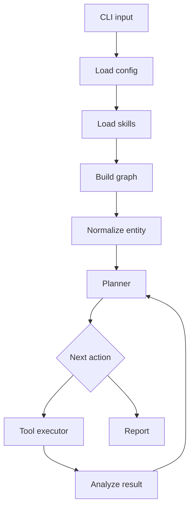
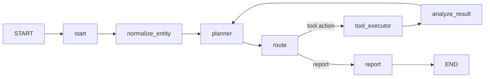
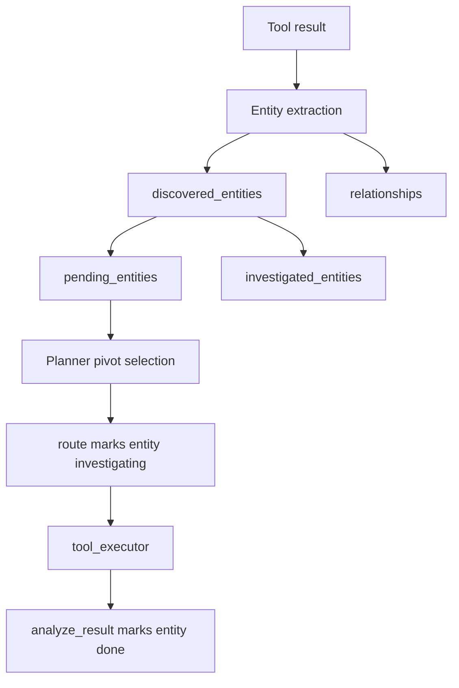

# Argus Architecture

## Overview

Argus is an autonomous investigation agent built with LangGraph. It normalizes a seed entity, runs planner-selected tools, analyzes tool output for new pivots, and produces a structured report.

## Project structure

```
src/argus
├── app/                  CLI/runtime entrypoints
│   ├── cli.py
│   ├── main.py
│   └── runner.py
├── core/                 Graph, state, config, cache, trace
│   ├── cache.py
│   ├── config.py
│   ├── graph.py
│   ├── state.py
│   └── trace.py
├── exporters/            Deterministic artifact exporters
│   ├── artifacts.py
│   ├── markdown.py
│   ├── mermaid.py
│   └── serialization.py
├── skills/               Skill loading and models
│   ├── loader.py
│   └── models.py
├── tools/                Investigation tools
│   ├── base.py
│   ├── registry.py
│   ├── dns/
│   │   └── lookup.py
│   ├── entity/
│   │   └── extraction.py
│   └── whois/            WHOIS/RDAP lookup + normalization
│       ├── lookup.py
│       ├── normalize.py
│       └── models.py
└── utils/                Small generic helpers
    ├── sanitize.py
    └── time.py
```

## High-level flow



## Core idea

Argus is no longer just a planner/tool loop. It now has an in-memory investigation layer:

- `discovered_entities`
- `pending_entities`
- `investigated_entities`
- `relationships`

This memory lives entirely inside `GraphState`.

## Graph nodes

| Node | Purpose |
|---|---|
| `start` | Initialize runtime state |
| `normalize_entity` | Normalize input and seed investigation memory |
| `planner` | Choose next tool or `report` |
| `route` | Validate decision and update entity status |
| `tool_executor` | Execute the selected tool |
| `analyze_result` | Discover pivots and relationships from the latest tool result |
| `report` | Generate final Markdown report |

## Graph edges



## Investigation memory



## Key modules

### `app/` — CLI/runtime entrypoints

- `cli.py` — Argument parsing, stdin reading, and skill selection
- `main.py` — Top-level `main()` function, wraps `cli.run_cli()`
- `runner.py` — Graph execution loop with streaming and artifact writing

### `core/` — Graph, state, config, cache, trace

- `graph.py` — All graph nodes, entity extraction, planner, report generation
- `state.py` — TypedDict definitions for `GraphState`, `EntityRecord`, etc.
- `config.py` — JSON config loading, validation, provider resolution
- `cache.py` — SQLite-backed `ToolCache` for tool execution results
- `trace.py` — Rich console rendering for graph execution steps

### `tools/` — Investigation tools

- `base.py` — `Tool` dataclass and `ToolResult`/`StructuredToolOutput` TypedDicts
- `registry.py` — `ToolRegistry` class for managing and executing tools with caching
- `dns/lookup.py` — DNS A/AAAA, MX, NS, SOA, TXT resolution plus reverse DNS pivots
- `dns/models.py` — Pydantic models for reverse DNS and NS lookup results
- `entity/extraction.py` — Entity normalization (domain, URL, IP) from raw input
- `tls/lookup.py` — TLS certificate lookup via standard library `ssl` and `socket`
- `tls/models.py` — Pydantic model for normalized TLS certificate pivot data
- `whois/lookup.py` — WHOIS/RDAP lookup with `registration_lookup` tool
- `whois/normalize.py` — Raw RDAP/WHOIS to `NormalizedRegistrationResult` normalization
- `whois/models.py` — Pydantic models for registration contacts, IP/domain registrations

### `exporters/` — Deterministic artifact exporters

- `artifacts.py` — Orchestrates artifact writing to `/tmp/argus/`
- `markdown.py` — Report and timeline Markdown export
- `mermaid.py` — Mermaid graph export
- `serialization.py` — JSON-safe state serialization

### `skills/` — Skill loading and models

- `models.py` — `Skill` dataclass
- `loader.py` — YAML frontmatter parsing and skill loading from filesystem

### `utils/` — Small generic helpers only

- `sanitize.py` — Safe path component slug generation
- `time.py` — Timestamp formatting

## Constraints preserved

- planner action schema is still tool-or-report
- individual tool interfaces are unchanged
- graph architecture is still LangGraph state + nodes + edges
- no external memory store, graph database, or vector store

## Current Investigation Tools

- `dns_a_lookup` — domain/hostname to A and AAAA pivots
- `dns_mx_lookup` — domain to MX host pivots
- `dns_ns_lookup` — domain to nameserver pivots
- `dns_soa_lookup` — SOA metadata, mainly for contextual evidence
- `dns_txt_lookup` — TXT records for supporting evidence
- `registration_lookup` — normalized WHOIS/RDAP pivots for domains and IPs
- `tls_certificate_lookup` — domain/hostname to SAN-domain pivots
- `reverse_dns_lookup` — IP to PTR hostname pivots
