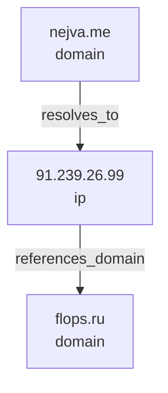

# Investigation Artifacts

Argus now writes deterministic investigation artifacts by default after every completed run.

## Default behavior

If the `output` section is missing from `~/.config/argus/config.json`, Argus uses:

```json
{
  "output": {
    "dir": "/tmp/argus",
    "write_by_default": true,
    "formats": [
      "report.md",
      "timeline.md",
      "graph.mmd",
      "snapshots.json",
      "state.json"
    ]
  }
}
```

Artifacts are written into a run-specific directory:

```text
/tmp/argus/<safe-entity>-<timestamp>/
```

Example:

```text
/tmp/argus/nejva-me-20260613-142210/
  report.md
  timeline.md
  graph.mmd
  snapshots.json
  state.json
```

The timestamp uses local run time in `YYYYMMDD-HHMMSS` format.

## What gets saved

### `report.md`

Human-readable Markdown report with:

- summary
- key findings
- Mermaid graph block
- entities table
- relationships table
- tool runs table
- links to debug artifacts

### `timeline.md`

Chronological Markdown timeline generated from the event log.

### `graph.mmd`

Raw Mermaid graph built from every discovered relationship. At this stage Argus does not filter noisy entities. Domains such as `rdap.db.ripe.net`, resolver infrastructure, CDN IPs, PDFs, and similar pivots are preserved exactly as discovered.

Example:



### `snapshots.json`

JSON array of planner-time snapshots. Each snapshot records:

- planner step number
- selected entity and tool
- planner reason
- queue contents at the moment of selection
- entity, relationship, and tool-run counters

Snapshots exist for debugging and reproducibility. They make it possible to inspect why the agent selected a pivot and what alternative pivots were still pending at that moment.

### `state.json`

Pretty-printed machine-readable investigation state containing:

- original input
- normalized entity and type
- entities
- relationships
- tool runs
- events
- snapshots
- final report

For registration lookups, `tool_runs` keep both:

- `normalized`: the normalized registration result used by planner/graph/queue/report
- `raw`: the original WHOIS/RDAP payload kept only for debug and reproducibility

Datetime values are serialized as ISO strings. Non-JSON tool output values are converted to dicts, lists, or strings so the file remains valid JSON.

## Raw graph vs future filtered graph

The current graph export is intentionally raw. It preserves all discovered entities and relationships, including low-signal or noisy pivots. This is useful during development because it keeps the original investigation state intact.

Registration lookups are the exception in one important sense: the raw WHOIS/RDAP payload is preserved in debug artifacts, but graph construction uses only normalized registration findings.

A future filtered graph may classify or score entities and hide low-value pivots in presentation-oriented views, but the raw state should still retain everything that was found.

## Configuration

### Disable artifact writing

Set:

```json
{
  "output": {
    "write_by_default": false
  }
}
```

### Change the output directory

Set:

```json
{
  "output": {
    "dir": "/path/to/artifacts"
  }
}
```

### Limit written formats

Set `output.formats` to any subset of:

- `report.md`
- `timeline.md`
- `graph.mmd`
- `snapshots.json`
- `state.json`
