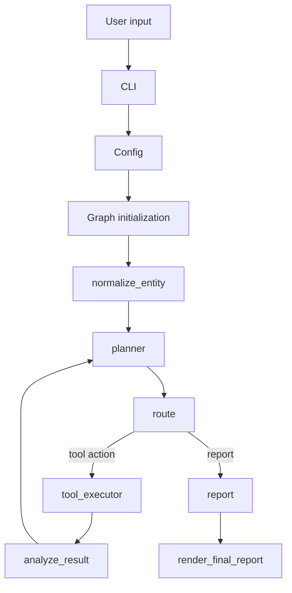
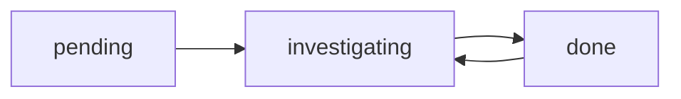

# Investigation Flow

The full investigation flow from user input to final report.



## Runtime loop

```text
normalize_entity
  -> planner
  -> route
  -> tool_executor
  -> analyze_result
  -> planner
  -> ...
  -> report
```

## Node responsibilities

### `normalize_entity`

- Normalizes raw input into `entity` and `entity_type`
- Seeds investigation memory with the starting entity
- Initializes the event log

### `planner`

- Sees tool results and investigation memory
- Chooses the next tool or `report`
- Is explicitly guided to prefer meaningful pending pivots over low-value enumeration

### `route`

- Validates planner output
- Enforces stop conditions
- Marks a selected pending entity as `investigating`

### `tool_executor`

- Executes the selected tool through the shared registry
- Stores the raw `ToolResult`
- Records cache metadata and tool execution events

### `analyze_result`

- Reads the latest `ToolResult`
- Extracts newly discovered entities from existing tool output
- Adds relationships between parent and discovered entities
- Updates entity status:
  - investigated input -> `done`
  - newly found pivots -> `pending`
- Appends investigation events without making any network requests

### `report`

- Builds the final structured report
- Includes discovered entities, relationships, timeline, evidence, and raw output

## Investigation memory lifecycle



- `pending`: discovered but not yet chosen by the planner
- `investigating`: selected by the planner as the next pivot
- `done`: at least one investigation step completed for that entity

Entities can move from `done` back to `investigating` if the planner decides to revisit them with a different tool.
