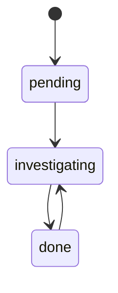

# Investigation Memory

Argus now tracks pivots discovered during an investigation in memory.

## State fields

### `discovered_entities`

Ordered list of entity records:

```python
{
    "value": "mx1.phdays.com",
    "type": "domain",
    "source_tool": "dns_mx_lookup",
    "parent": "phdays.com",
    "status": "pending",
    "relationship": "has_mx",
}
```

### `pending_entities`

Subset of `discovered_entities` where `status == "pending"`.

These are candidate pivots for the planner.

### `investigated_entities`

Ordered list of entity values whose current status is `done`.

### `relationships`

Ordered list of source-target relationships:

```python
{
    "source": "phdays.com",
    "target": "mx1.phdays.com",
    "relationship": "has_mx",
}
```

## Discovery rules

### DNS A/AAAA

`domain -> resolves_to -> ip`

### DNS MX

`domain -> has_mx -> mail host`

### DNS SOA

`domain -> has_nameserver -> mname`

### WHOIS / RDAP

Extracts only values that are actually present, including:

- domains
- IP addresses
- nameservers
- emails
- ASNs

## Status transitions



## Planner impact

The planner now sees the memory layer directly and is instructed to favor meaningful pending pivots before additional low-value enumeration.
