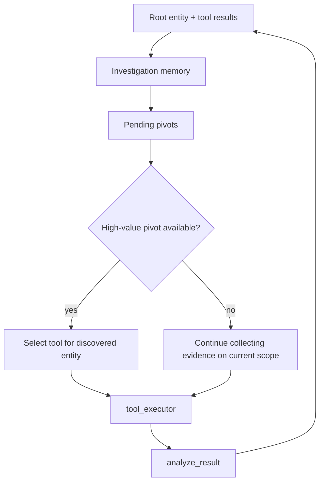

# Planner

## Overview

The planner is still a single LLM call inside `build_graph()` in `src/argus/graph.py`. It was not rewritten; it now receives more context.

## What changed

The planner now sees:

- event timeline
- discovered entities
- pending entities
- investigated entities
- relationships
- prior tool results

The core action model is unchanged:

- choose an enabled tool name
- provide `tool_input`
- or choose `report`

## Planner guidance

The system prompt now includes explicit pivot guidance:

- prefer investigating meaningful pending entities before collecting additional low-value information
- focus on newly discovered domains, nameservers, IPs, and other infrastructure
- avoid repeating the full history inside `reasoning_summary`

## Response schema

```json
{
  "reasoning_summary": "why this next action is the best pivot",
  "next_action": "dns_a_lookup | dns_mx_lookup | dns_soa_lookup | dns_txt_lookup | registration_lookup | report",
  "tool_input": "mx1.phdays.com",
  "stop_reason": ""
}
```

For stop decisions:

```json
{
  "reasoning_summary": "the main pivots were investigated and the evidence is sufficient",
  "next_action": "report",
  "tool_input": "",
  "stop_reason": "sufficient evidence collected from discovered infrastructure"
}
```

## Decision process



## Fallback behavior

If the LLM is unavailable, fallback selection also prefers `pending_entities` first:

- pending IP -> `registration_lookup`
- pending domain -> prefer `dns_a_lookup`, then `registration_lookup`, then other DNS tools

Only after pending pivots are exhausted does fallback return to the original root-entity-first behavior.
