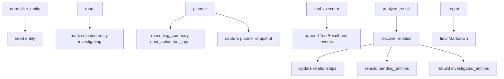

# State Model

Defined in `src/argus/graph.py` as `GraphState`.

## Core execution fields

| Field | Type | Purpose |
|---|---|---|
| `raw_input` | `str` | Original user input |
| `entity` | `str` | Normalized seed entity |
| `entity_type` | `str` | Seed entity type (`domain`, `url`, `ip`, `unknown`) |
| `run_started_at` | `datetime` | Local start time for the investigation run |
| `events` | `list[str]` | Chronological investigation timeline |
| `reasoning_summary` | `str` | Planner reasoning for the current decision |
| `next_action` | `str` | Planner-selected tool or `report` |
| `tool_input` | `str` | Input for the selected tool |
| `stop_reason` | `str` | Why the investigation stopped |
| `skill_name` | `str` | Selected skill name |
| `tool_results` | `list[ToolResult]` | Raw tool execution history |
| `steps_remaining` | `int` | Remaining execution budget |
| `report` | `str` | Final Markdown report |

## Investigation memory fields

| Field | Type | Purpose |
|---|---|---|
| `discovered_entities` | `list[EntityRecord]` | Ordered list of all discovered pivots |
| `pending_entities` | `list[EntityRecord]` | Ordered list of pivots not yet investigated |
| `investigated_entities` | `list[str]` | Ordered list of entities marked `done` |
| `relationships` | `list[RelationshipRecord]` | Ordered list of source-target investigation relationships |
| `snapshots` | `list[SnapshotRecord]` | Planner-time snapshots of the selected action and queue |

## `EntityRecord`

```python
{
    "value": "mx1.phdays.com",
    "type": "domain",
    "source_tool": "dns_mx_lookup",
    "parent": "phdays.com",
    "status": "pending",
    "relationship": "has_mx",
}
```

## `RelationshipRecord`

```python
{
    "source": "phdays.com",
    "target": "mx1.phdays.com",
    "relationship": "has_mx",
}
```

## `SnapshotRecord`

```python
{
    "step": 3,
    "selected": {
        "entity": "flops.ru",
        "tool": "registration_lookup",
        "reason": "Likely owner domain referenced from IP registration",
    },
    "queue": [
        {
            "entity": "flops.ru",
            "type": "domain",
            "status": "pending",
            "source": "91.239.26.99",
            "score": 0.91,
        }
    ],
    "entities_count": 12,
    "relationships_count": 8,
    "tool_runs_count": 5,
}
```

## Write path



## Status semantics

- `pending`: discovered and queued as a possible pivot
- `investigating`: currently selected by the planner
- `done`: at least one investigation step completed for that entity

## Read path

- `planner` reads all memory fields plus tool results
- `route` reads the selected action and updates entity status
- `analyze_result` reads the latest tool result and mutates investigation memory
- `report` reads both evidence and memory to build the final report
